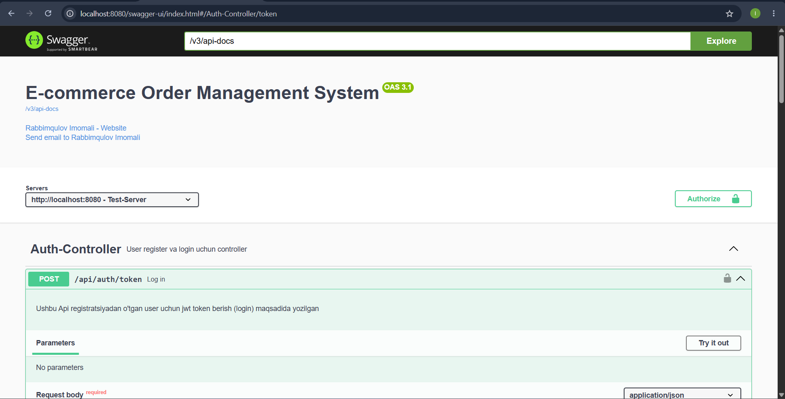
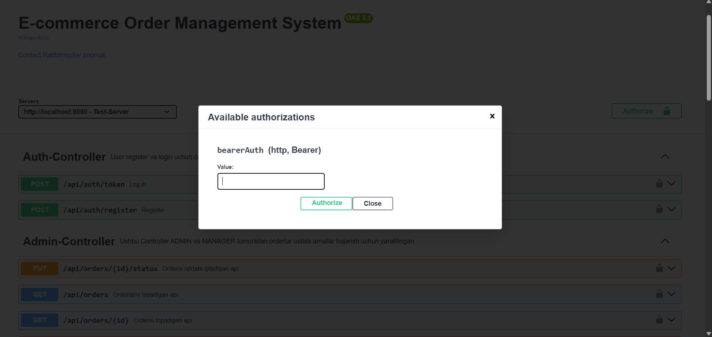

# E-Commerce Order Management System

A RESTful API for managing products and customer orders in an e-commerce system. The application provides JWT-based authentication, role-based authorization, product management, and order management functionalities.


---

## Features

### Authentication & Authorization

* User Registration
* User Login
* JWT Token Authentication
* Role-Based Access Control (RBAC)
  
---
Supported Roles:

* ADMIN
* MANAGER
* USER

---

## Product Management

### Public/User Access

* View all products
* View product details by ID
* Search products by name and category
* Pagination and sorting support

### ADMIN / MANAGER Access

* Create new products
* Update existing products
* Delete products

---

## Order Management

### USER Access

* Create orders
* View own orders
* View own order details
* Update own orders (when allowed)
* Delete own orders (when allowed)

### ADMIN / MANAGER Access

* View all orders
* View order by ID
* Update order status
* Delete orders
* View customer orders by email

---

## Technology Stack

* Java
* Spring Boot
* Spring Security
* JWT Authentication
* Spring Data JPA
* PostgreSQL
* H2
* Hibernate
* Bean Validation
* Swagger / OpenAPI 3
* Maven

---

## API Endpoints

### Authentication

| Method | Endpoint             | Description             |
| ------ | -------------------- | ----------------------- |
| POST   | `/api/auth/register` | Register new user       |
| POST   | `/api/auth/token`    | Login and get JWT token |

---

### Products

| Method | Endpoint                          | Access         |
| ------ |-----------------------------------| -------------- |
| GET    | `/api/products`                   | All Users      |
| GET    | `/api/products/all`               | All Users      |
| GET    | `/api/products/get-all`           | All Users      |
| GET    | `/api/products/{id}`              | All Users      |
| GET    | `/api/products/search`            | All Users      |
| GET    | `/api/products/pagination_search` | All Users      |
| POST   | `/api/products`                   | ADMIN, MANAGER |
| PUT    | `/api/products/{id}`              | ADMIN, MANAGER |
| DELETE | `/api/products/{id}`              | ADMIN, MANAGER |

---

### User Orders

| Method | Endpoint                  | Access |
| ------ |---------------------------| ------ |
| GET    | `/api/orders/user`        | USER   |
| GET    | `/api/orders/user/{id}`   | USER   |
| POST   | `/api/orders`             | USER   |
| PUT    | `/api/orders/user/update` | USER   |
| DELETE | `/api/orders/user/{id}`   | USER   |

---

### Order Administration

| Method | Endpoint                       | Access         |
| ------ | ------------------------------ | -------------- |
| GET    | `/api/orders`                  | ADMIN, MANAGER |
| GET    | `/api/orders/{id}`             | ADMIN, MANAGER |
| PUT    | `/api/orders/{id}/status`      | ADMIN, MANAGER |
| DELETE | `/api/orders/{id}`             | ADMIN, MANAGER |
| GET    | `/api/orders/customer/{email}` | ADMIN, MANAGER |

---

## Security

This project uses JWT authentication.

After successful login:

```http
Authorization: Bearer YOUR_TOKEN
```

must be included in protected requests.

---

## Validation & Exception Handling

The application includes:

* Request validation using Jakarta Validation
* Global exception handling
* Custom business exceptions
* Meaningful error responses

Examples:

* ProductNotFoundException
* OrderNotFoundException
* AuthenticationException
* ConstraintViolationException
* MethodArgumentNotValidException

---

## API Documentation

Swagger UI is available after application startup:

```text
http://localhost:8080/swagger-ui/index.html
```

OpenAPI Specification:

```text
http://localhost:8080/v3/api-docs
```

The project includes comprehensive Swagger documentation using:

* @Tag
* @Operation
* @ApiResponse
* @Schema

annotations.

---

## Installation

### Clone Repository

```bash
git clone https://github.com/alibackenddev/e-commerce-order-management-system.git
```

### Configure Database

Update database settings in:

```properties
src/main/resources/application.properties
```

Example:

```properties
spring.datasource.url=jdbc:postgresql://localhost:5432/ecommerce_db
spring.datasource.username=postgres
spring.datasource.password=password
```

### Run Application

Using Maven:

```bash
mvn spring-boot:run
```

or

```bash
./mvnw spring-boot:run
```

Application will start at:

```text
http://localhost:8080
```

---

## Project Structure

```text
controller/
service/
repository/
entity/
dto/
config/
security/
exception_handling/
log/
mapper/
enums/
```

---

## Author

Developed as a Spring Boot E-Commerce Order Management System project.
